--- 
title: "Hadley Tidy Talk"
author: "Raymond Balise"
date: "`r Sys.Date()`"
site: bookdown::bookdown_site
documentclass: book
output:
  bookdown::gitbook: 
    config:
      toc:
        collapse: false 
    toc_depth: 3
    css: "style.css"
    number_sections: true
description: "Notes from the Garvin"

editor_options: 
  chunk_output_type: console
bibliography: bibliography.bib
---

# Intro {-}
This work is based on: https://github.com/hadley/tidy-tools

This work is licensed as Creative Commons Attribution-ShareAlike 4.0 International.  
To view a copy of this license, visit
https://creativecommons.org/licenses/by-sa/4.0/


### Outline 

1. Intros & warmups
2. ”The whole game”
3. Testing
4. Documentation
5. Sharing
6. Dependencies
7. Tidyverse + packages

```{r setup, include=FALSE, message=FALSE}
knitr::opts_chunk$set(eval = FALSE)
```

## Intros & Warmups

### Books

https://r-pkgs.org/  
https://rstats.wtf  
https://happygitwithr.com  


### Handful of ways of installing packages

```{r index-1}
install.packages("devtools")
pak::pkg_install("devtools")

devtools::install_github("r-lib/itdepends")
remotes::install_github("r-lib/itdepends")
pak::pkg_install("r-lib/itdepends")
```

What's the difference between devtools and remotes?

### Your turn

How does installing a package change your computer?  
What is a library? How many libraries do you have? Which is the default?  

```{r index-2}
.Library
.libPaths()
```

### Library = directory of R packages

base R =

* 14 base packages+
* 29 recommended (also on CRAN) packages

Automatically installed with R.

### Your turn

How does running library(dplyr) affect your computer? How is it connected to your  libraries?

Hint: try comparing this code before and after

```{r index-3}
data.frame(
  env = search(),
  path = searchpaths()
)
```

### Kinds of packages

```{r, eval=TRUE, cache=FALSE, echo=FALSE, fig.cap="Kinds of kinds of packages"}
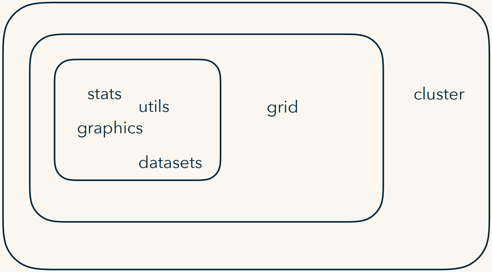
```


### What is installed

`library(pkg)` attaches a package
7 base packages are always attached

Use R --vanilla to check

## ”The whole game”

What follows is adapted from **The Whole Game** chapter in the revised version of R Packages.
https://r-pkgs.org/whole-game.html

A proper package for the care and feeding of factors: **forcats**
https://forcats.tidyverse.org

### What is a package?

A package is a set of conventions that (with the right tools) makes your life easier

### `usethis::create_package()`

### What does `create_package()` do?

### `use_git()`
Not going to teach it,
but diffs are helpful

### `use_r()`


### Factors can be vexing (1)

```{r index-4}
(a <- factor(c("character", "in", "the", "streets")))
# > [1] character in the streets
# > Levels: character in streets the

(b <- factor(c("integer", "in", "the", "sheets")))
# > [1] integer in the sheets
# > Levels: in integer sheets the

c(a, b)
# > [1] 1 2 4 3 2 1 4 3
```

### Factors can be vexing (2)

```{r index-5}
factor(c(as.character(a), as.character(b)))
# > [1] character in the streets integer in
# > [7] the sheets
# > Levels: character in integer sheets streets the
```
Let's turn this into our first function:

`fbind()`

### Where do we define functions?

Beautiful pairing: `use_r()` & `use_test()`

## There's a usethis helper for that too!

```{r index-6}
usethis::use_r("file-name")
```

Organize files so that related code lives together. If you can give a file a concise and informative name, it's probably about right


### Now what?

~~source("R/fbind.R")~~

~~Use IDE tricks to send definition of fbind() to the R Console~~

> Instead use:

```{r index-7}
devtools::load_all()
```

`devtools::load_all()`

### Why do we love devtools? Workflow!

Reload code:

```{r index-8}
devtools::load_all()
```

<font color="red">Cmd/Ctrl + Shift + L</font>

```{r, eval=TRUE, cache=FALSE, echo=FALSE, fig.cap="Load All Workflow"}
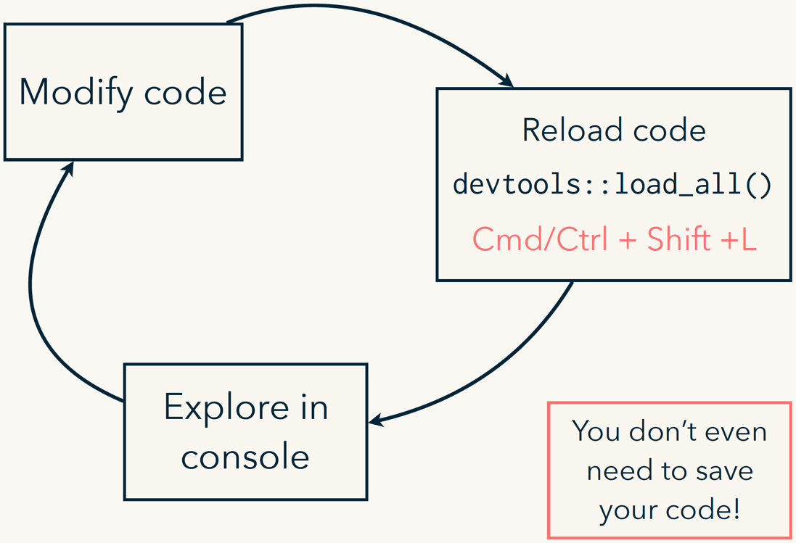
```


### `load_all` is like...

> Load all simulates installing a package and loading a package

devtools::load_all()
≈
install.packages() +
library()


### `devtools::check()`

check() ≈ R CMD check

* Checks package for technical validity
* Do from R or RStudio (<font color="red">Ctrl/cmd + shift + e</font>)
* check() early, check() often
* Get it working, keep it working
* Necessary (but not sufficient) for CRAN
* Excellent way to run your tests (and more)

### `devtools::document()`


### roxygen2 turns comments into help

RStudio helper: Code > Insert roxygen skeleton

```{r index-9}
#' Bind two factors
#'
#' Create a new factor from two existing factors, where the new
#' factor's levels are the union of the levels of the input
#' factors.
#'
#' @param a factor
#' @param b factor
#'
#' @return factor
#' @export
#' @examples
#' fbind(factor(letters[1:3]), factor(letters[26:24]))
fbind <- function(a, b) {
  factor(c(as.character(a), as.character(b)))
}
```

### Make a package!


### Beware!

You’re probably used to maintaining a .R file containing snippets of code that you use to automate various bits of your workflow.  
Don’t save this in R/!  
What happens if you have `load_all()` inside a file inside of R/? What happens if you have `usethis::edit_r_profile()`?  
Where should you save it? I use Untitled.

### Your turn

```
# Create a package with:
usethis::create_package("~/Desktop/foofactors")
# Notice that you're now in a new RStudio instance.
# Continue on through the next slides to repeat the actions I showed you.
# Stuck? Raise a pink post it
```

### Use usethis::use_r("fbind") to create a new file
In it, define a function named "fbind" that combines its inputs (presumably factors) like so:


### Your turn

* coerce each input to character
* combine inputs
* make output a factor

```{r index-10}
factor(c(as.character(a), as.character(b)))
```

Check that you can devtools::load_all()

### Your turn (2)

Add docs for `fbind()` as a roxygen comment

* RStudio helper: Code > Insert roxygen skeleton
* Lines MUST start with #'

`document()`

Preview with `?fbind`

`check()` again and ... rejoice!

### Your turn (2)

Setup R and RStudio
Edit DESCRIPTION (optional)

* Make yourself the author
* Update Title and Description

`use_mit_license("Your Name")`

`check()` again, if you wish

### Your turn (3)

Install your foofactors package

* Call `install()` in R
* RStudio Build & Restart
* Shell: `R CMD build` + `R CMD install`

Restart R

Attach like a "regular" package with `library()`
Call fbind()

### `usethis` workflow

```{r index-11}
usethis::create_package()
usethis::use_r()
devtools::load_all()
devtools::check()
usethis::use_mit_license()
devtools::document()
devtools::install()
```

# Unit testing

## Motivation

### Let’s add a column to a data frame

Goal: Write a function that allows us to add a new column to a data frame at a specified
position.

```{r index-12}
add_col(df, "name", value, where = 1)
add_col(df, "name", value, where = 2)
```

Start simple and try out as we go.

```{r, eval=TRUE, cache=FALSE, echo=FALSE, fig.cap="Where to add columns"}
knitr::include_graphics("./images/addWhere.png")
```


### Start with `insert_into()`

```{r index-13}
df1 <- data.frame(a = 3, b = 4, c = 5)
df2 <- data.frame(X = 1, Y = 2)
```

```{r index-14}
insert_into(
  df1, df2,
  where = 1
)

insert_into(
  df1, df2,
  where = 2
)
```

Works like `cbind()` but can insert anywhere

```{r, eval=TRUE, cache=FALSE, echo=FALSE, fig.cap="Insert Into"}
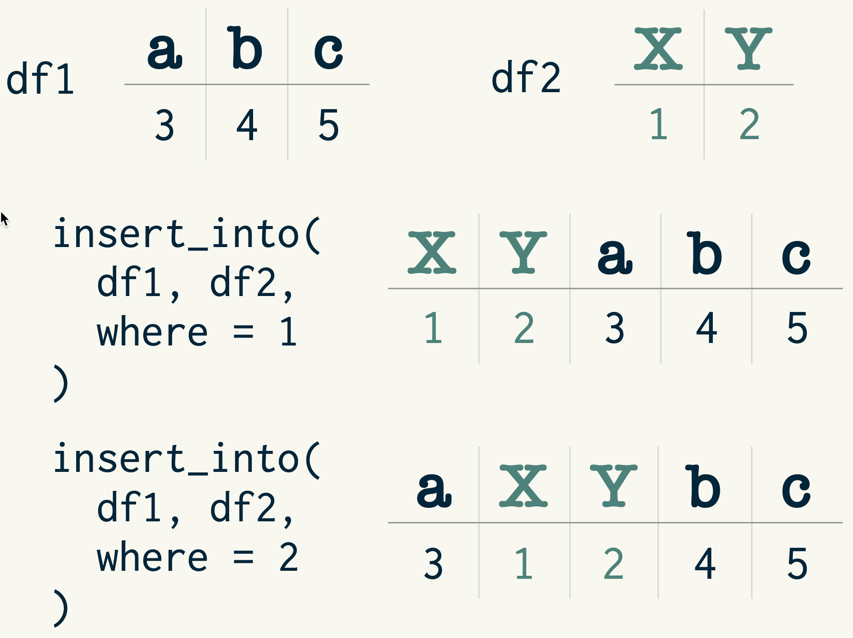
```

Add the columns of `df2` to `df1` at position `where`

### What goes in ...?

```{r index-15 }
insert_into <- function(x, y, where = 1) {
  if (where == 1) { # first col
    ...
  } else if (where > ncol(x)) { # last col
    ...
  } else {
    ...
  }
}
```

Hint: `cbind()` will be useful

Add the columns of df2 to df1 at position where

### My first attempt

```{r index-16}
insert_into <- function(x, y, where = 1) {
  if (where == 1) {
    cbind(x, y)
  } else if (where > ncol(x)) {
    cbind(y, x)
  } else {
    cbind(x[1:where], y, x[where:ncol(x)])
  }
}
```

### Actually correct

```{r index-17}
insert_into <- function(x, y, where = 1) {
  if (where == 1) {
    cbind(y, x)
  } else if (where > ncol(x)) {
    cbind(x, y)
  } else {
    lhs <- 1:(where - 1)
    cbind(x[lhs], y, x[-lhs])
  }
}
```

### How did I write that code?

````{r}
# Some simple inputs
df1 <- data.frame(a = 3, b = 4, c = 5)
df2 <- data.frame(X = 1, Y = 2)

# Then each time I tweaked it, I re-ran these cases
insert_into(df1, df2, where = 1)
insert_into(df1, df2, where = 2)
insert_into(df1, df2, where = 3)
```

### Two challenges

* Cmd + Enter is error prone
* Looking at the outputs of each run is tedious

### We need a new workflow!

* Cmd + Enter is error prone
    + Put code in R/ and use `devtools::load_all()`
Looking at the outputs of each run is tedious    
    + Write unit tests and use `devtools::test_file()`
    
## Testing workflow

http://r-pkgs.had.co.nz/tests.html    


### First, create a package

```{r index-18}
usethis::create_package("~/Desktop/hadcol")
usethis::use_r("insert_into")
```

copy + paste this code into insert_into.R

```{r index-19}
insert_into <- function(x, y, where = 1) {
  if (where == 1) {
    cbind(y, x)
  } else if (where > ncol(x)) {
    cbind(x, y)
  } else {
    lhs <- 1:(where - 1)
    cbind(x[lhs], y, x[-lhs])
  }
}
```

### Then, set up testing infrastructure

```{r index-20}
usethis::use_test() # makes a testing file
devtools::test_file() # runs test
```


```{r, eval=TRUE, cache=FALSE, echo=FALSE, fig.cap="use test"}
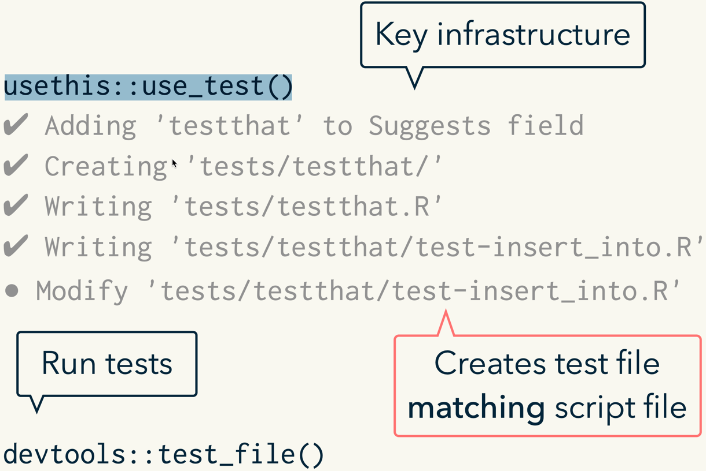
```

### So far we’ve done this:


### `Testthat` gives a new workflow

Reload code: <font color="red">Cmd/Ctrl + Shift + L</font>  
Run test: <font color="red">Cmd/Ctrl + Shift + T</font>


```{r, eval=TRUE, cache=FALSE, echo=FALSE, fig.cap="New workflow"}
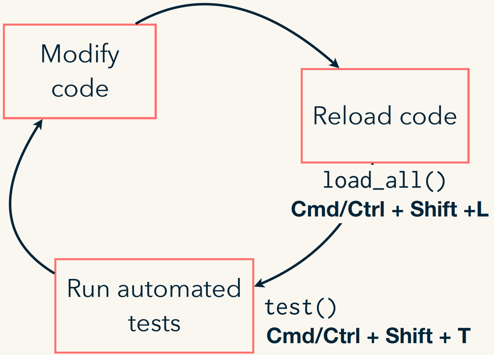
```

Run test **file**: <font color="red">Cmd/Ctrl + T</font>

```{r, eval=TRUE, cache=FALSE, echo=FALSE, fig.cap="New workflow file"}
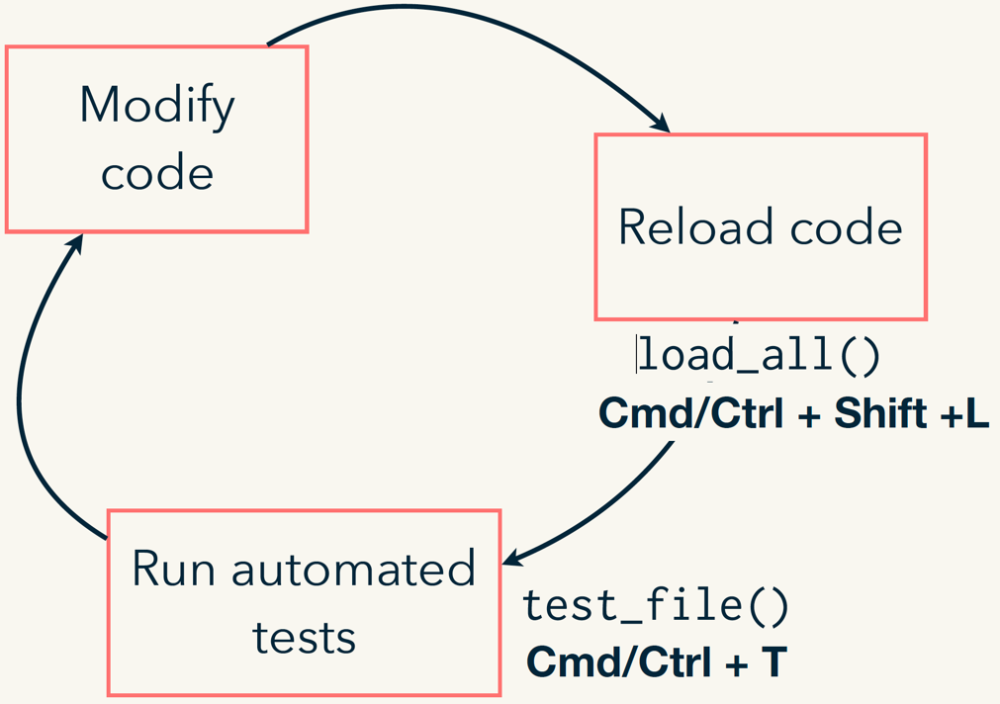
```

### But why reload the code?

```{r, eval=TRUE, cache=FALSE, echo=FALSE, fig.cap="Why reload"}
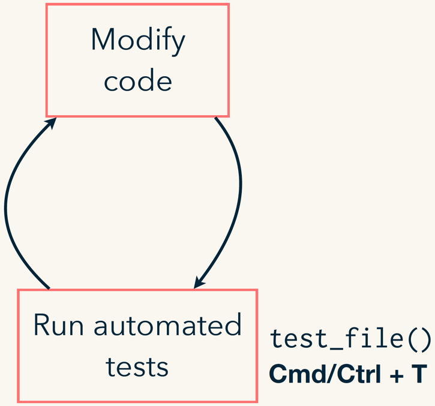
```

### Key idea of unit testing is to automate!

Helper function to reduce duplication:
```{r index-21}
at_pos <- function(i) {
  insert_into(df1, df2, where = i)
}
```

Describes an expected property of the output:
```{r index-22}
expect_named(at_pos(1), c("X", "Y", "a", "b", "c"))
expect_named(at_pos(2), c("a", "X", "Y", "b", "c"))
expect_named(at_pos(3), c("a", "b", "X", "Y", "c"))
```

### This automation must follow conventions

In tests/testthat/test-insert_into.R

```{r index-23}
test_that("can add column at any position", {
  df1 <- data.frame(a = 3, b = 4, c = 5)
  df2 <- data.frame(X = 1, Y = 2)
  at_pos <- function(i) {
    insert_into(df1, df2, where = i)
  }

  expect_named(at_pos(1), c("X", "Y", "a", "b", "c"))
  expect_named(at_pos(2), c("a", "X", "Y", "b", "c"))
  expect_named(at_pos(3), c("a", "b", "X", "Y", "c"))
})
```

### Tests are organized in three layers
```{r, eval=TRUE, cache=FALSE, echo=FALSE, fig.cap="[Tests are organized"}
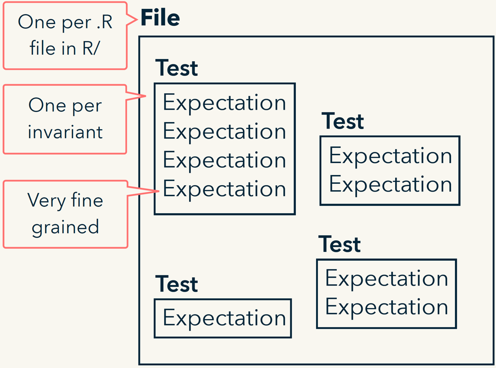
```


### Setup keyboard shortcuts


```{r, eval=TRUE, cache=FALSE, echo=FALSE, fig.cap="Modify keyboard"}
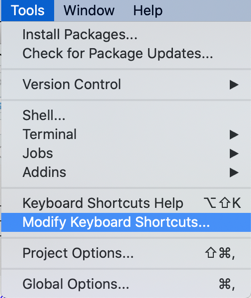
```

> Note: My *Calculate package test coverage* uses cmd instead of Hadley's ctrl

```{r, eval=TRUE, cache=FALSE, echo=FALSE, fig.cap="Keyboar options"}
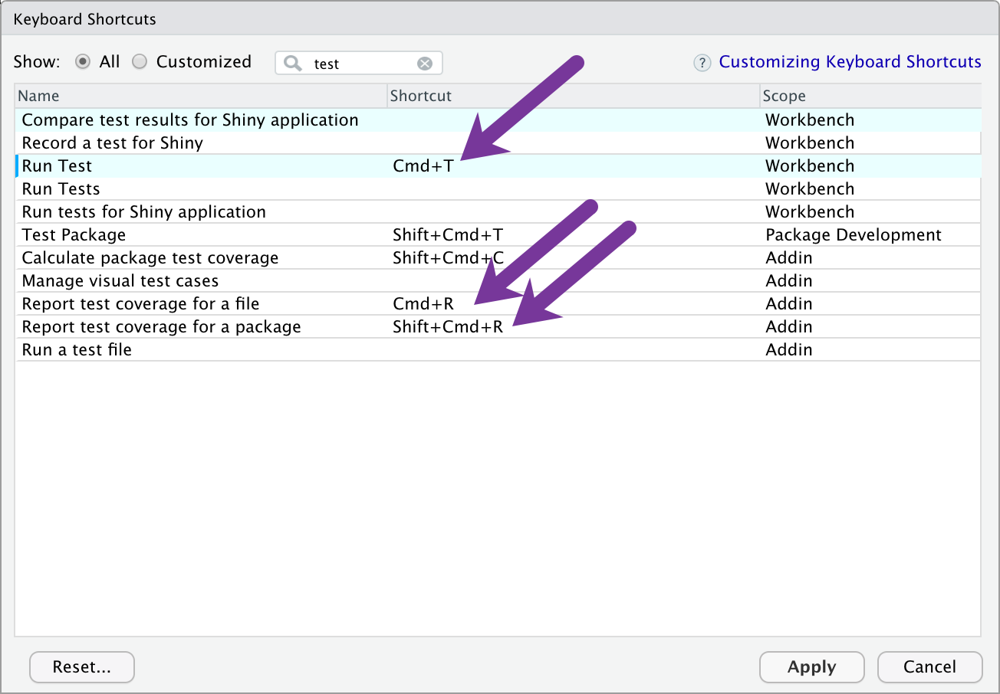
```

### Practice the workflow

```{r index-24}
usethis::create_package("~/Desktop/hadcol")

usethis::use_r("insert_into")
# Check all is ok with load_all()

usethis::use_test()
# Copy expectations from next next slide
```

Run tests with keyboard shortcut (if you create it).  
Or `devtools::test_file()`  
Confirm that if you break `insert_into()` the tests fail.

### Expectations

```{r index-25}
# Create file with use_test()
test_that("can add column at any position", {
  df1 <- data.frame(a = 3, b = 4, c = 5)
  df2 <- data.frame(X = 1, Y = 2)
  at_pos <- function(i) {
    insert_into(df1, df2, where = i)
  }
  expect_named(at_pos(1), c("X", "Y", "a", "b", "c"))
  expect_named(at_pos(2), c("a", "X", "Y", "b", "c"))
  expect_named(at_pos(3), c("a", "b", "X", "Y", "c"))
})
```

## Test coverage

https://covr.r-lib.org

### Test coverage shows you what you’ve tested

```{r index-26}
devtools::test_coverage_file()
devtools::test_coverage()
usethis::use_coverage()
```

### Guide tests with coverage


```{r, eval=TRUE, cache=FALSE, echo=FALSE, fig.cap="Guide tests"}
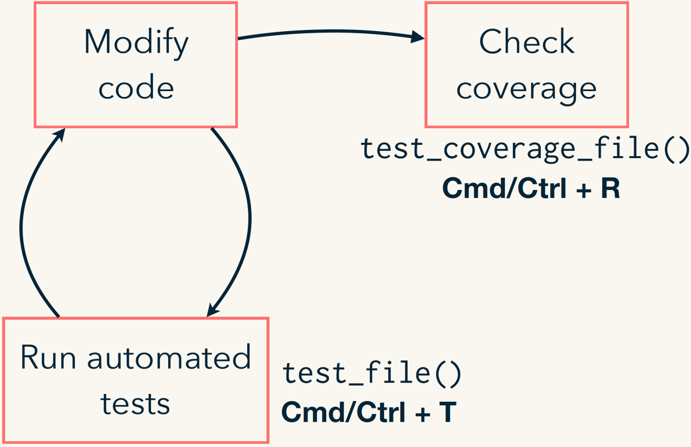
```

```{r, eval=TRUE, cache=FALSE, echo=FALSE, fig.cap="Guide tests2"}
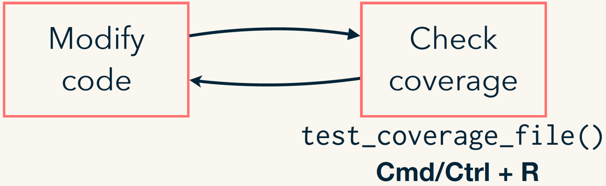
```

### Practice the (new) workflow

```{r index-27}
devtools::test_coverage_file()
```

Are all the lines covered (green)?
If not add a test for the missing case
Check you now cover all cases

### codecov 


```{r, eval=TRUE, cache=FALSE, echo=FALSE, fig.cap="Codecov"}
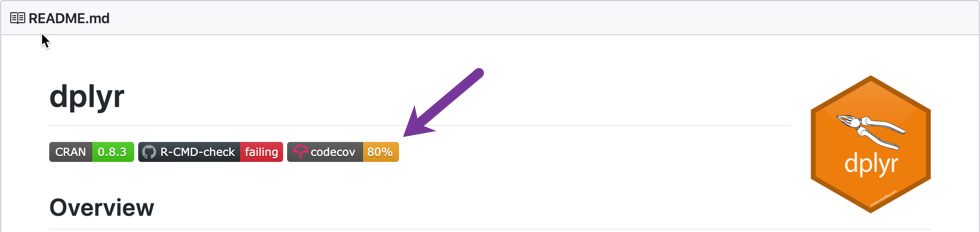
```

Builds confidence
Guides contributors

## Other advantages

* Writing tests improves your interface
* Improve readability or performance without changing behavior.
* When you stop work, leave a test failing

## add_col

### Or you might start with the tests

```{r, eval=TRUE, cache=FALSE, echo=FALSE, fig.cap="Start with tests"}
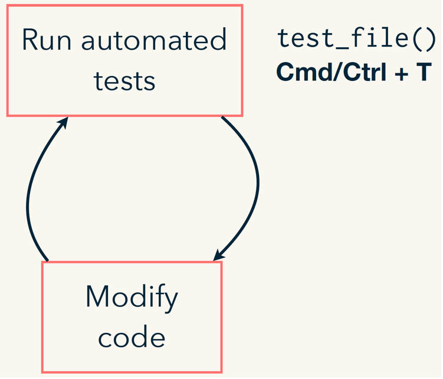
```


This is called test driven development (TDD)

### Next challenge is to implement add_col()

```{r index-28}
df <- data.frame(x = 1)

add_col(df, "y", 2, where = 1)
add_col(df, "y", 2, where = 2)
add_col(df, "x", 2)
```

### Most important expectation

```{r index-29}
expect_equal(obj, exp)
expect_equal(my_function(x, y), 1)
```

More at http://testthat.r-lib.org

### `expecct_equal()`

```{r index-30}
expect_equal(my_function(x, y), 1)

out <- my_function(x, y)

# Test basic shape
expect_equal(is.list(out), TRUE)
expect_equal(length(out), 3)

# Test specific values
expect_equal(out[[1]], 10)
expect_equal(out[[2]], data.frame(x = 1))
```

### More specialised expectations save typing

```{r index-31}
expect_equal(is.list(out), TRUE)
expect_true(is.list(out))
expect_type(out, "list")

expect_equal(length(out), 3)
expect_length(out, 3)
```

### Make these tests pass

```{r index-32}
usethis::use_test("add_col")

# Copy this test:
test_that("where controls position", {
  df <- data.frame(x = 1)
  expect_equal(
    add_col(df, "y", 2, where = 1),
    data.frame(y = 2, x = 1)
  )
  expect_equal(
    add_col(df, "y", 2, where = 2),
    data.frame(x = 1, y = 2)
  )
})
```

Run tests with keyboard shortcut
Some hints on next slide

### Hint: getting started

```{r index-33}
usethis::use_r("add_col")
```

In R/add_col.R

Start by establishing basic form of the function and setting up the test case.

```{r index-34}
add_col <- function(x, name, value, where) {
}
```

Make sure that you can <font color="red">Cmd + T</font> and get two test failures before you continue

More hints on the next slide

### Hint: add_col()

You'll need to use `insert_into()`

`insert_into()` takes two data frames and you have a data frame and a vector

`setNames()` lets you change the names of data frame

### My solution
Lives in R/add_col.R

```{r index-35}
add_col <- function(x, name, value, where) {
  df <- setNames(data.frame(value), name)
  insert_into(x, df, where = where)
}
```

### Make this test pass

Add me to test-add_col.R

```{r index-36}
test_that("can replace columns", {
  df <- data.frame(x = 1)
  expect_equal(
    add_col(df, "x", 2, where = 2),
    data.frame(x = 2)
  )
})
```


### My solution

```{r index-37}
add_col <- function(x, name, value, where) {
  if (name %in% names(x)) {
    x[[name]] <- value
    x
  } else {
    df <- setNames(data.frame(value), name)
    insert_into(x, df, where = where)
  }
}
```

### Make this test pass

Add me to test-add_col.R

```{r index-38}
test_that("default where is far right", {
  df <- data.frame(x = 1)
  expect_equal(
    add_col(df, "y", 2),
    data.frame(x = 1, y = 2)
  )
})
```

### positions

```{r, eval=TRUE, cache=FALSE, echo=FALSE, fig.cap="Positions"}
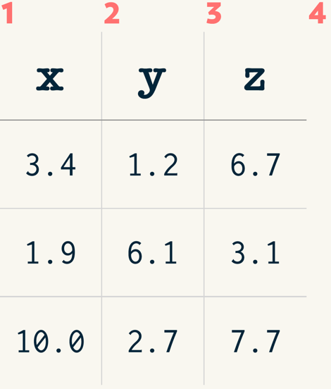
```

### My solution

```{r index-39}
add_col <- function(x, name, value,
                    where = ncol(x) + 1) {
  if (name %in% names(x)) {
    x[[name]] <- value
    x
  } else {
    df <- setNames(data.frame(value), name)
    insert_into(x, df, where = where)
  }
}
```

### What about bad inputs?

We need to test for errors too

```{r index-40}
df1 <- data.frame(a = 3, b = 4, c = 5)
df2 <- data.frame(X = 1, Y = 2)

insert_into(df1, df2, where = 0)
insert_into(df1, df2, where = NA)
insert_into(df1, df2, where = 1:10)
insert_into(df1, df2, where = "a")
```


### Testing summary
```{r, eval=TRUE, cache=FALSE, echo=FALSE, fig.cap="Testing"}
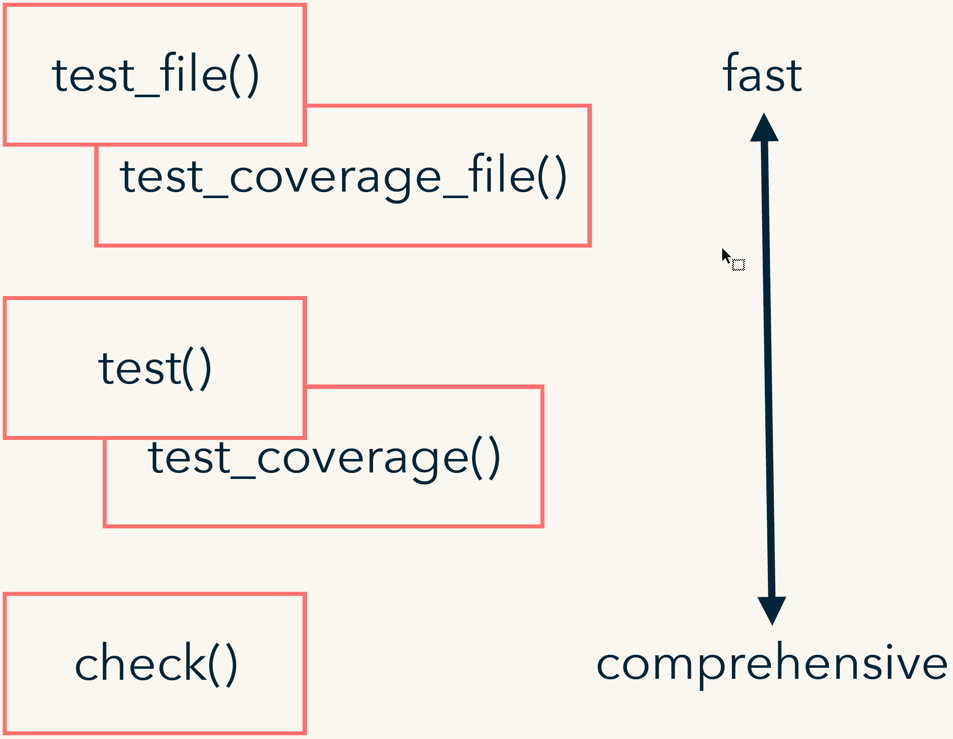
```


# Document and share

### Overview
 
1. Function docs
2. Other docs
3. R CMD check
4. CRAN submission

## Function docs with `roxygen2`

### `Roxygen2`
```{r, eval=TRUE, cache=FALSE, echo=FALSE, fig.cap="Roxygen2"}
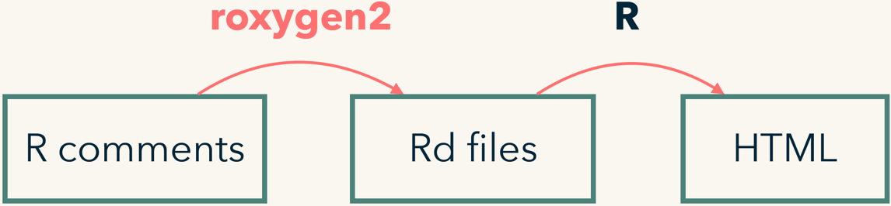
```

http://r-pkgs.had.co.nz/man.html

### You write specially formatted comments in .R

In R/add_col.R

```{r}
#' Add a column to a data frame
#'
#' Allows you to specify the position. Will replace existing variable
#'   with the same name if present.
#'
#' @param x A data frame
#' @param name Name of variable to create. If a variable of that name
#'   already exists it will be replaced
#' @param value Values to insert.
#' @param where Position to insert. Use 1 to insert on LHS, or -1 to insert on
#'   RHS.
#' @examples
#' df <- data.frame(x = 1:5)
#' add_col(df, "y", runif(5))
#' add_col(df, "y", runif(5), where = 1)
#'
#' add_col(df, "x", 5:1)
```

### You write specially formatted comments in <font color="red">.R</font>

In R/add_col.R

<font color="blue">Roxygen comment</font>  
<font color="#ffa7b6">Roxygen tag</font>

<font color="blue">\#'</font> Add a column to a data frame  
<font color="blue">\#'</font>   
<font color="blue">\#'</font> Allows you to specify the position. Will replace existing variable  
<font color="blue">\#'</font>   with the same name if present.  
<font color="blue">\#'</font>  
<font color="blue">\#'</font> <font color="#ffa7b6">\@param</font> x A data frame  
<font color="blue">\#'</font> <font color="#ffa7b6">\@param</font> name Name of variable to create. If a variable of that name  
<font color="blue">\#'</font>   already exists it will be replaced  
<font color="blue">\#'</font> <font color="#ffa7b6">\@param</font> value Values to insert.  
<font color="blue">\#'</font> <font color="#ffa7b6">\@param</font> where Position to insert. Use 1 to insert on LHS, or -1 to insert on
<font color="blue">\#'</font>   RHS.  
<font color="blue">\#'</font> <font color="#ffa7b6">\@examples</font>  
<font color="blue">\#'</font> df <- data.frame(x = 1:5)  
<font color="blue">\#'</font> add_col(df, "y", runif(5))  
<font color="blue">\#'</font> add_col(df, "y", runif(5), where = 1)  
<font color="blue">\#'</font>  
<font color="blue">\#'</font> add_col(df, "x", 5:1)  

### Roxygen translates to <font color="red">.Rd</font>

* In almost all cases you can ignore these files

In man/add_col.Rd

```
% Generated by roxygen2: do not edit by hand
% Please edit documentation in R/add_col.R
\name{add_col}
\alias{add_col}
\title{Add a column to a data frame}
\usage{
add_col(x, name, value, ncol(x) + 1)
}
\arguments{
\item{x}{A data frame}
\item{name}{Name of variable to create. If a variable of that name
already exists it will be replaced}
\item{value}{Values to insert.}
\item{where}{Position to insert. Use 1 to insert on LHS.}
}
\description{
Allows you to specify the position. Will replace existing variable
with the same name if present.
}
```

### R documentation

R translates to <font color="red">.html</font> for viewing

```{r, eval=TRUE, cache=FALSE, echo=FALSE, fig.cap="html documentation"}
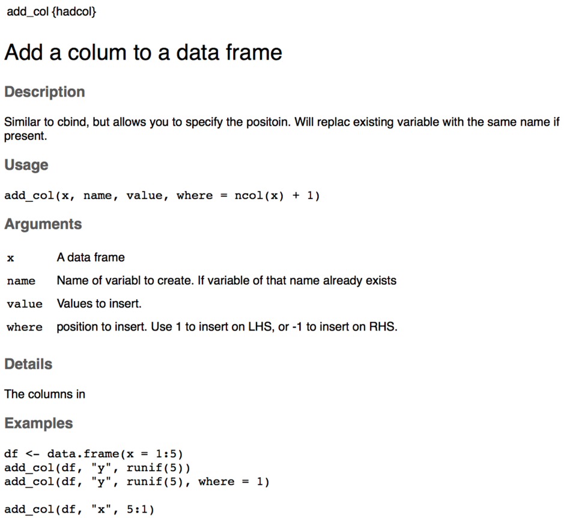
```

### Documenting

```{r, eval=TRUE, cache=FALSE, echo=FALSE, fig.cap="Documentation image"}
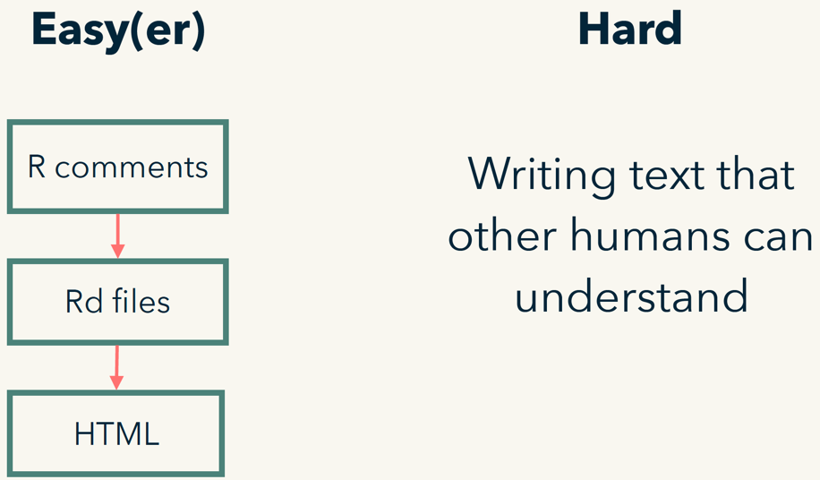
```


### Documentation workflow

<font color="red">Cmd/Ctrl + Shift + D</font>  
`devtools::document()`

```{r, eval=TRUE, cache=FALSE, echo=FALSE, fig.cap="Documentation workflow image"}
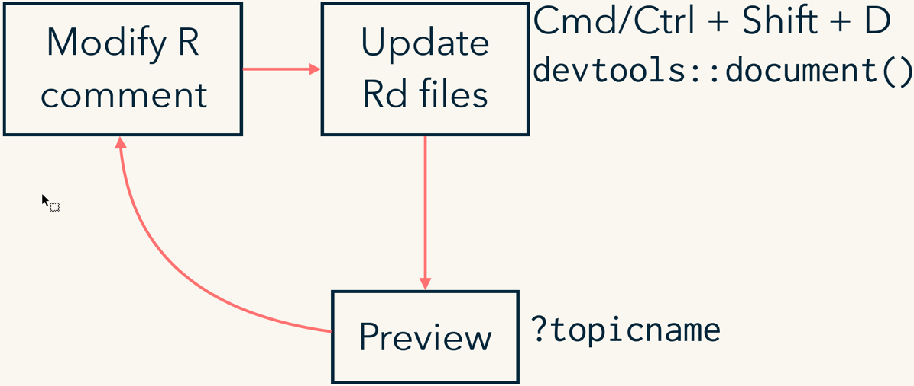
```

### Two caveats

1. You must have loaded the package with `load_all()` at least once.
    + Check for message "Using development documentation..."
2. This technique only builds individual files so links do not work.

## Change project to: [fordogs]

`create_from_github("hadley/fordogs", fork = FALSE)`

### Your turn

Fix the typos in the documentation for fbind().

Run the documentation workflow to check yourwork.

```{r, eval=TRUE, cache=FALSE, echo=FALSE, fig.cap="Parts of documentation"}
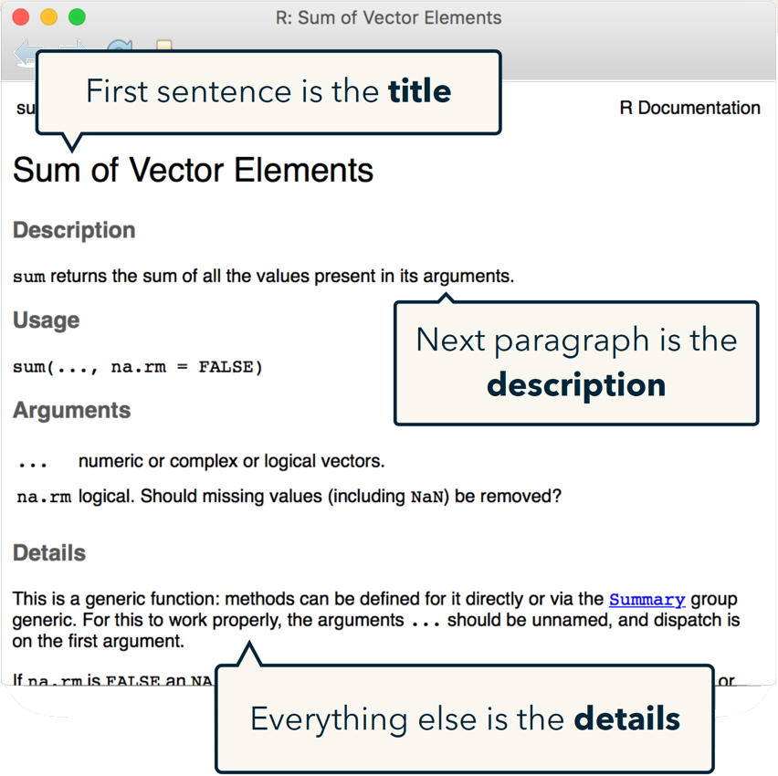
```

### The description block

```{r, eval=TRUE, cache=FALSE, echo=FALSE, fig.cap="The description block"}
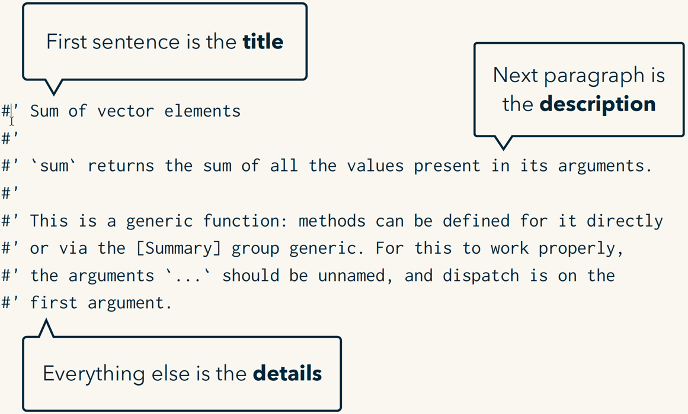
```


### There are five tags you’ll use for most functions

| Tag | Purpose |
| :--- | :--------------------------------------------------- |
| \@param arg | Describe inputs |
| \@examples | Show how the function works. (Usual RStudio shortcuts work) |
| \@seealso | Pointers to related functions |
| \@return | Describe outputs (value) |
| \@export | Is this a user-visible function? |

https://roxygen2.r-lib.org/articles/rd.html

### Your turn

Complete the documentation for `fbind()`.

A good minimum is to describe the types of the input and output (we’ll talk a lot more about types tomorrow).

### RStudio helps you remember

```{r, eval=TRUE, cache=FALSE, echo=FALSE, fig.cap="Roxygen function skeleton"}
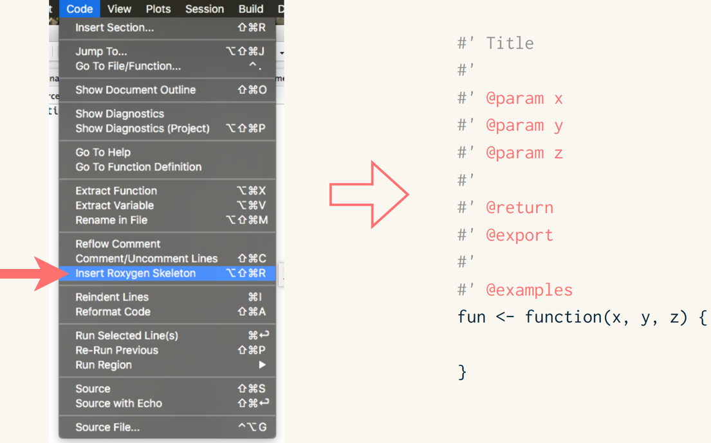
```

### Your turn

Document `fdist()`.

```{r}
fdist(factor(rpois(50, 5)))
fdist(factor(rpois(500, 5)))
fdist(factor(round(rnorm(100, 5))))

fdist(ggplot2::diamonds$cut)
fdist(ggplot2::diamonds$cut, sort = TRUE)
```

### Use markdown for formatting

In new package, activate roxygen by running
`usethis::use_roxygen_md()`

> Remember: To use roxygen when writing documentation type: `usethis::use_roxygen_md()`

* **bold**, _italic_, `code`
* [func()]
* [pkg::func()]
* [link text][func()]
* [link text][pkg::func()]

### Documentation workflow 2

```{r, eval=TRUE, cache=FALSE, echo=FALSE, fig.cap="Documentation workflow 2"}
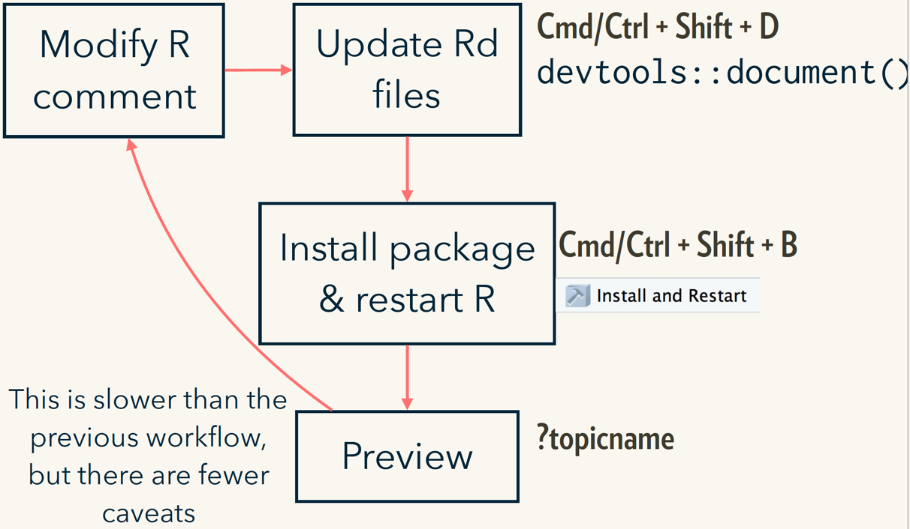
```

run once: `usethis::use_roxygen_md()`

<font color="red">Cmd/Ctrl + Shift + D</font>  
`devtools::document()`

<font color="red">Cmd/Ctrl + Shift + B</font>

?topicname

## Package documentation with rmarkdown

### Big picture in README

* 2-3 paragraph overview
* Installation instructions
* Usage example, with pointer to vignettes

### Use vignettes for broader topics

`usethis::use_vignette("name")`

* Adds to DESCRIPTION
    + Suggests: knitr
    + VignetteBuilder: knitr
* Creates vignettes/
* Drafts vignettes/name.Rmd

### Vignette = Rmarkdown + special metadata

```{r, eval=TRUE, cache=FALSE, echo=FALSE, fig.cap="vignette with YAML"}
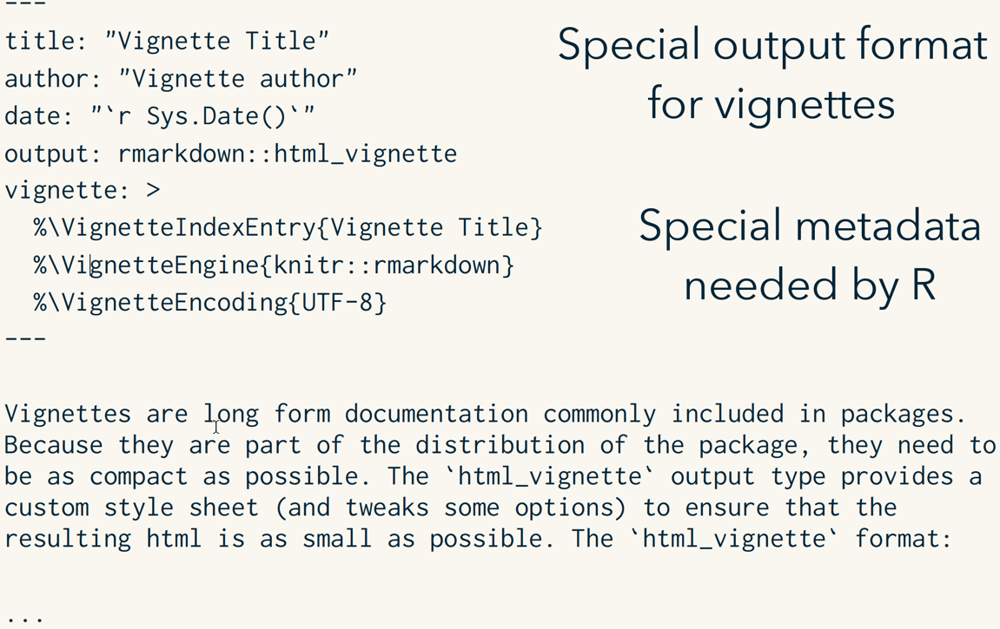
```

### If evolving over time, note changes to API

`usethis::use_news_md()`

* what's new
* what's changed
* what's gone away

More info at: http://style.tidyverse.org/news.html

### Turn into a website with pkgdown

```{r eval=TRUE, echo=FALSE, fig.cap="Pkgdown logo", out.width = "30%", fig.align = 'center', cache=FALSE}
knitr::include_graphics("https://github.com/rstudio/hex-stickers/raw/master/PNG/pkgdown.png")
```

```{r}
use_pkgdown()
use_pkgdown_travis()
```


## R CMD check

### Automated checking

*Runs automated checks for common problems in R packages.
Useful for local packages, even with some false positives.
If you want to submit to CRAN, you must pass R CMD check cleanly.
