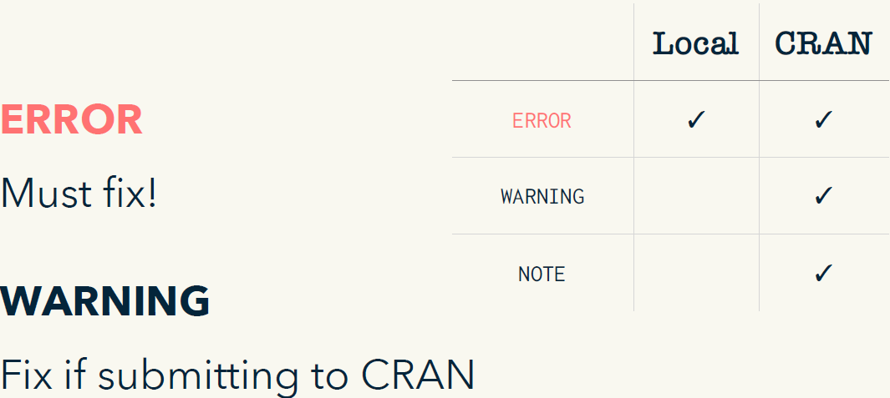
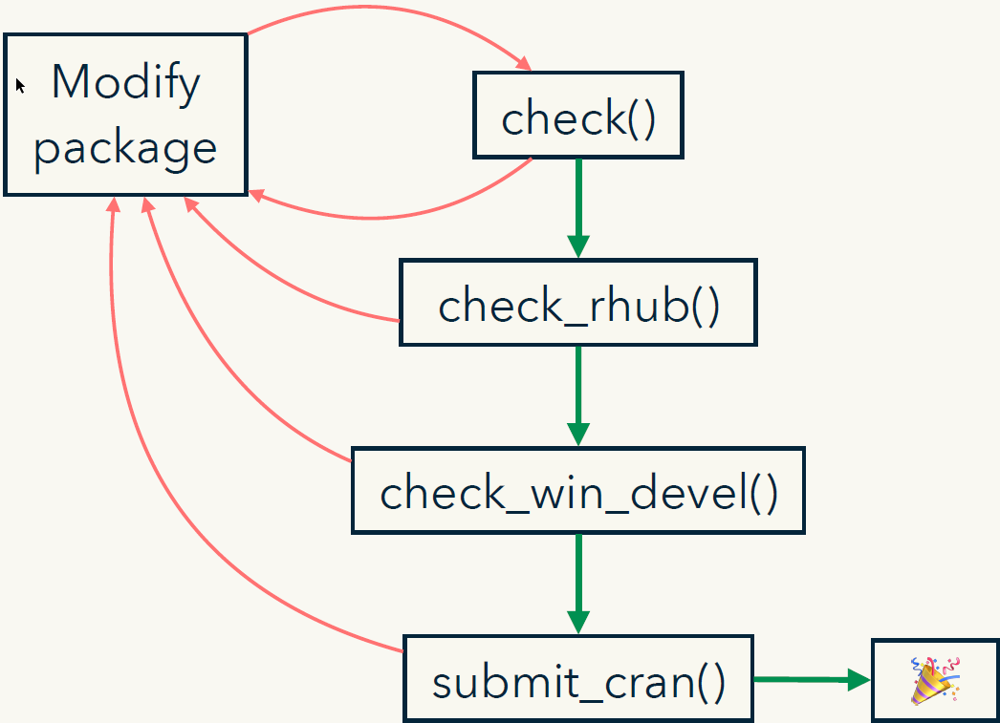

--- 
title: "Hadley Tidy Talk"
author: "Raymond Balise"
date: "`r Sys.Date()`"
site: bookdown::bookdown_site
documentclass: book
output:
  bookdown::gitbook: 
    config:
      toc:
        collapse: false 
    toc_depth: 3
    css: "style.css"
    number_sections: true
description: "Notes from the Tidy Tools Workshops"

editor_options: 
  chunk_output_type: console
bibliography: bibliography.bib
---

# Intro {-}
This work is based on: https://github.com/hadley/tidy-tools

This work is licensed as Creative Commons Attribution-ShareAlike 4.0 International.  
To view a copy of this license, visit
https://creativecommons.org/licenses/by-sa/4.0/


### Outline 

1. Intros & warmups
2. ”The whole game”
3. Testing
4. Documentation
5. Sharing
6. Dependencies
7. Tidyverse + packages

```{r setup, include=FALSE, message=FALSE}
knitr::opts_chunk$set(eval = FALSE)
```

## Intros & Warmups

### Books

https://r-pkgs.org/  
https://rstats.wtf  
https://happygitwithr.com  


### Handful of ways of installing packages

```{r index-1}
install.packages("devtools")
pak::pkg_install("devtools")

devtools::install_github("r-lib/itdepends")
remotes::install_github("r-lib/itdepends")
pak::pkg_install("r-lib/itdepends")
```

What's the difference between devtools and remotes?

### Your turn

How does installing a package change your computer?  
What is a library? How many libraries do you have? Which is the default?  

```{r index-2}
.Library
.libPaths()
```

### Library = directory of R packages

base R =

* 14 base packages+
* 29 recommended (also on CRAN) packages

Automatically installed with R.

### Your turn

How does running library(dplyr) affect your computer? How is it connected to your  libraries?

Hint: try comparing this code before and after

```{r index-3}
data.frame(
  env = search(),
  path = searchpaths()
)
```

### Kinds of packages

```{r, eval=TRUE, cache=FALSE, echo=FALSE, fig.cap="Kinds of kinds of packages"}
knitr::include_graphics("./images/kindsOfPackages.png")
```


### What is installed

`library(pkg)` attaches a package
7 base packages are always attached

Use R --vanilla to check

## ”The whole game”

What follows is adapted from **The Whole Game** chapter in the revised version of R Packages.
https://r-pkgs.org/whole-game.html

A proper package for the care and feeding of factors: **forcats**
https://forcats.tidyverse.org

### What is a package?

A package is a set of conventions that (with the right tools) makes your life easier

### `usethis::create_package()`

### What does `create_package()` do?

### `use_git()`
Not going to teach it,
but diffs are helpful

### `use_r()`


### Factors can be vexing (1)

```{r index-4}
(a <- factor(c("character", "in", "the", "streets")))
# > [1] character in the streets
# > Levels: character in streets the

(b <- factor(c("integer", "in", "the", "sheets")))
# > [1] integer in the sheets
# > Levels: in integer sheets the

c(a, b)
# > [1] 1 2 4 3 2 1 4 3
```

### Factors can be vexing (2)

```{r index-5}
factor(c(as.character(a), as.character(b)))
# > [1] character in the streets integer in
# > [7] the sheets
# > Levels: character in integer sheets streets the
```
Let's turn this into our first function:

`fbind()`

### Where do we define functions?

Beautiful pairing: `use_r()` & `use_test()`

## There's a usethis helper for that too!

```{r index-6}
usethis::use_r("file-name")
```

Organize files so that related code lives together. If you can give a file a concise and informative name, it's probably about right


### Now what?

~~source("R/fbind.R")~~

~~Use IDE tricks to send definition of fbind() to the R Console~~

> Instead use:

```{r index-7}
devtools::load_all()
```

`devtools::load_all()`

### Why do we love devtools? Workflow!

Reload code:

```{r index-8}
devtools::load_all()
```

<font color="red">Cmd/Ctrl + Shift + L</font>

```{r, eval=TRUE, cache=FALSE, echo=FALSE, fig.cap="Load All Workflow"}
knitr::include_graphics("./images/load_all.png")
```


### `load_all` is like...

> Load all simulates installing a package and loading a package

devtools::load_all()
≈
install.packages() +
library()


### `devtools::check()`

check() ≈ R CMD check

* Checks package for technical validity
* Do from R or RStudio (<font color="red">Ctrl/cmd + shift + e</font>)
* check() early, check() often
* Get it working, keep it working
* Necessary (but not sufficient) for CRAN
* Excellent way to run your tests (and more)

### `devtools::document()`


### roxygen2 turns comments into help

RStudio helper: Code > Insert roxygen skeleton

```{r index-9}
#' Bind two factors
#'
#' Create a new factor from two existing factors, where the new
#' factor's levels are the union of the levels of the input
#' factors.
#'
#' @param a factor
#' @param b factor
#'
#' @return factor
#' @export
#' @examples
#' fbind(factor(letters[1:3]), factor(letters[26:24]))
fbind <- function(a, b) {
  factor(c(as.character(a), as.character(b)))
}
```

### Make a package!


### Beware!

You’re probably used to maintaining a .R file containing snippets of code that you use to automate various bits of your workflow.  
Don’t save this in R/!  
What happens if you have `load_all()` inside a file inside of R/? What happens if you have `usethis::edit_r_profile()`?  
Where should you save it? I use Untitled.

### Your turn

```
# Create a package with:
usethis::create_package("~/Desktop/foofactors")
# Notice that you're now in a new RStudio instance.
# Continue on through the next slides to repeat the actions I showed you.
# Stuck? Raise a pink post it
```

### Use usethis::use_r("fbind") to create a new file
In it, define a function named "fbind" that combines its inputs (presumably factors) like so:


### Your turn

* coerce each input to character
* combine inputs
* make output a factor

```{r index-10}
factor(c(as.character(a), as.character(b)))
```

Check that you can devtools::load_all()

### Your turn (2)

Add docs for `fbind()` as a roxygen comment

* RStudio helper: Code > Insert roxygen skeleton
* Lines MUST start with #'

`document()`

Preview with `?fbind`

`check()` again and ... rejoice!

### Your turn (2)

Setup R and RStudio
Edit DESCRIPTION (optional)

* Make yourself the author
* Update Title and Description

`use_mit_license("Your Name")`

`check()` again, if you wish

### Your turn (3)

Install your foofactors package

* Call `install()` in R
* RStudio Build & Restart
* Shell: `R CMD build` + `R CMD install`

Restart R

Attach like a "regular" package with `library()`
Call fbind()

### `usethis` workflow

```{r index-11}
usethis::create_package()
usethis::use_r()
devtools::load_all()
devtools::check()
usethis::use_mit_license()
devtools::document()
devtools::install()
```

# Unit testing

## Motivation

### Let’s add a column to a data frame

Goal: Write a function that allows us to add a new column to a data frame at a specified
position.

```{r index-12}
add_col(df, "name", value, where = 1)
add_col(df, "name", value, where = 2)
```

Start simple and try out as we go.

```{r, eval=TRUE, cache=FALSE, echo=FALSE, fig.cap="Where to add columns"}
knitr::include_graphics("./images/addWhere.png")
```


### Start with `insert_into()`

```{r index-13}
df1 <- data.frame(a = 3, b = 4, c = 5)
df2 <- data.frame(X = 1, Y = 2)
```

```{r index-14}
insert_into(
  df1, df2,
  where = 1
)

insert_into(
  df1, df2,
  where = 2
)
```

Works like `cbind()` but can insert anywhere

```{r, eval=TRUE, cache=FALSE, echo=FALSE, fig.cap="Insert Into"}
knitr::include_graphics("./images/insertInto.png")
```

Add the columns of `df2` to `df1` at position `where`

### What goes in ...?

```{r index-15 }
insert_into <- function(x, y, where = 1) {
  if (where == 1) { # first col
    ...
  } else if (where > ncol(x)) { # last col
    ...
  } else {
    ...
  }
}
```

Hint: `cbind()` will be useful

Add the columns of df2 to df1 at position where

### My first attempt

```{r index-16}
insert_into <- function(x, y, where = 1) {
  if (where == 1) {
    cbind(x, y)
  } else if (where > ncol(x)) {
    cbind(y, x)
  } else {
    cbind(x[1:where], y, x[where:ncol(x)])
  }
}
```

### Actually correct

```{r index-17}
insert_into <- function(x, y, where = 1) {
  if (where == 1) {
    cbind(y, x)
  } else if (where > ncol(x)) {
    cbind(x, y)
  } else {
    lhs <- 1:(where - 1)
    cbind(x[lhs], y, x[-lhs])
  }
}
```

### How did I write that code?

````{r}
# Some simple inputs
df1 <- data.frame(a = 3, b = 4, c = 5)
df2 <- data.frame(X = 1, Y = 2)

# Then each time I tweaked it, I re-ran these cases
insert_into(df1, df2, where = 1)
insert_into(df1, df2, where = 2)
insert_into(df1, df2, where = 3)
```

### Two challenges

* Cmd + Enter is error prone
* Looking at the outputs of each run is tedious

### We need a new workflow!

* Cmd + Enter is error prone
    + Put code in R/ and use `devtools::load_all()`
Looking at the outputs of each run is tedious    
    + Write unit tests and use `devtools::test_file()`
    
## Testing workflow

http://r-pkgs.had.co.nz/tests.html    


### First, create a package

```{r index-18}
usethis::create_package("~/Desktop/hadcol")
usethis::use_r("insert_into")
```

copy + paste this code into insert_into.R

```{r index-19}
insert_into <- function(x, y, where = 1) {
  if (where == 1) {
    cbind(y, x)
  } else if (where > ncol(x)) {
    cbind(x, y)
  } else {
    lhs <- 1:(where - 1)
    cbind(x[lhs], y, x[-lhs])
  }
}
```

### Then, set up testing infrastructure

```{r index-20}
usethis::use_test() # makes a testing file
devtools::test_file() # runs test
```


```{r, eval=TRUE, cache=FALSE, echo=FALSE, fig.cap="use test"}
knitr::include_graphics("./images/use_test.png")
```

### So far we’ve done this:


### `Testthat` gives a new workflow

Reload code: <font color="red">Cmd/Ctrl + Shift + L</font>  
Run test: <font color="red">Cmd/Ctrl + Shift + T</font>


```{r, eval=TRUE, cache=FALSE, echo=FALSE, fig.cap="New workflow"}
knitr::include_graphics("./images/newWorkflow.png")
```

Run test **file**: <font color="red">Cmd/Ctrl + T</font>

```{r, eval=TRUE, cache=FALSE, echo=FALSE, fig.cap="New workflow file"}
knitr::include_graphics("./images/newWorkflowFile.png")
```

### But why reload the code?

```{r, eval=TRUE, cache=FALSE, echo=FALSE, fig.cap="Why reload"}
knitr::include_graphics("./images/whyReload.png")
```

### Key idea of unit testing is to automate!

Helper function to reduce duplication:
```{r index-21}
at_pos <- function(i) {
  insert_into(df1, df2, where = i)
}
```

Describes an expected property of the output:
```{r index-22}
expect_named(at_pos(1), c("X", "Y", "a", "b", "c"))
expect_named(at_pos(2), c("a", "X", "Y", "b", "c"))
expect_named(at_pos(3), c("a", "b", "X", "Y", "c"))
```

### This automation must follow conventions

In tests/testthat/test-insert_into.R

```{r index-23}
test_that("can add column at any position", {
  df1 <- data.frame(a = 3, b = 4, c = 5)
  df2 <- data.frame(X = 1, Y = 2)
  at_pos <- function(i) {
    insert_into(df1, df2, where = i)
  }

  expect_named(at_pos(1), c("X", "Y", "a", "b", "c"))
  expect_named(at_pos(2), c("a", "X", "Y", "b", "c"))
  expect_named(at_pos(3), c("a", "b", "X", "Y", "c"))
})
```

### Tests are organized in three layers
```{r, eval=TRUE, cache=FALSE, echo=FALSE, fig.cap="[Tests are organized"}
knitr::include_graphics("./images/testsAreOrganized.png")
```


### Setup keyboard shortcuts


```{r, eval=TRUE, cache=FALSE, echo=FALSE, fig.cap="Modify keyboard"}
knitr::include_graphics("./images/keyboard.png")
```

> Note: My *Calculate package test coverage* uses cmd instead of Hadley's ctrl

```{r, eval=TRUE, cache=FALSE, echo=FALSE, fig.cap="Keyboar options"}
knitr::include_graphics("./images/keyboardOptions.png")
```

### Practice the workflow

```{r index-24}
usethis::create_package("~/Desktop/hadcol")

usethis::use_r("insert_into")
# Check all is ok with load_all()

usethis::use_test()
# Copy expectations from next next slide
```

Run tests with keyboard shortcut (if you create it).  
Or `devtools::test_file()`  
Confirm that if you break `insert_into()` the tests fail.

### Expectations

```{r index-25}
# Create file with use_test()
test_that("can add column at any position", {
  df1 <- data.frame(a = 3, b = 4, c = 5)
  df2 <- data.frame(X = 1, Y = 2)
  at_pos <- function(i) {
    insert_into(df1, df2, where = i)
  }
  expect_named(at_pos(1), c("X", "Y", "a", "b", "c"))
  expect_named(at_pos(2), c("a", "X", "Y", "b", "c"))
  expect_named(at_pos(3), c("a", "b", "X", "Y", "c"))
})
```

## Test coverage

https://covr.r-lib.org

### Test coverage shows you what you’ve tested

```{r index-26}
devtools::test_coverage_file()
devtools::test_coverage()
usethis::use_coverage()
```

### Guide tests with coverage


```{r, eval=TRUE, cache=FALSE, echo=FALSE, fig.cap="Guide tests"}
knitr::include_graphics("./images/guideTests.png")
```

```{r, eval=TRUE, cache=FALSE, echo=FALSE, fig.cap="Guide tests2"}
knitr::include_graphics("./images/guideTests2.png")
```

### Practice the (new) workflow

```{r index-27}
devtools::test_coverage_file()
```

Are all the lines covered (green)?
If not add a test for the missing case
Check you now cover all cases

### codecov 


```{r, eval=TRUE, cache=FALSE, echo=FALSE, fig.cap="Codecov"}
knitr::include_graphics("./images/codecov.png")
```

Builds confidence
Guides contributors

## Other advantages

* Writing tests improves your interface
* Improve readability or performance without changing behavior.
* When you stop work, leave a test failing

## add_col

### Or you might start with the tests

```{r, eval=TRUE, cache=FALSE, echo=FALSE, fig.cap="Start with tests"}
knitr::include_graphics("./images/startWithTests.png")
```


This is called test driven development (TDD)

### Next challenge is to implement add_col()

```{r index-28}
df <- data.frame(x = 1)

add_col(df, "y", 2, where = 1)
add_col(df, "y", 2, where = 2)
add_col(df, "x", 2)
```

### Most important expectation

```{r index-29}
expect_equal(obj, exp)
expect_equal(my_function(x, y), 1)
```

More at http://testthat.r-lib.org

### `expecct_equal()`

```{r index-30}
expect_equal(my_function(x, y), 1)

out <- my_function(x, y)

# Test basic shape
expect_equal(is.list(out), TRUE)
expect_equal(length(out), 3)

# Test specific values
expect_equal(out[[1]], 10)
expect_equal(out[[2]], data.frame(x = 1))
```

### More specialised expectations save typing

```{r index-31}
expect_equal(is.list(out), TRUE)
expect_true(is.list(out))
expect_type(out, "list")

expect_equal(length(out), 3)
expect_length(out, 3)
```

### Make these tests pass

```{r index-32}
usethis::use_test("add_col")

# Copy this test:
test_that("where controls position", {
  df <- data.frame(x = 1)
  expect_equal(
    add_col(df, "y", 2, where = 1),
    data.frame(y = 2, x = 1)
  )
  expect_equal(
    add_col(df, "y", 2, where = 2),
    data.frame(x = 1, y = 2)
  )
})
```

Run tests with keyboard shortcut
Some hints on next slide

### Hint: getting started

```{r index-33}
usethis::use_r("add_col")
```

In R/add_col.R

Start by establishing basic form of the function and setting up the test case.

```{r index-34}
add_col <- function(x, name, value, where) {
}
```

Make sure that you can <font color="red">Cmd + T</font> and get two test failures before you continue

More hints on the next slide

### Hint: add_col()

You'll need to use `insert_into()`

`insert_into()` takes two data frames and you have a data frame and a vector

`setNames()` lets you change the names of data frame

### My solution
Lives in R/add_col.R

```{r index-35}
add_col <- function(x, name, value, where) {
  df <- setNames(data.frame(value), name)
  insert_into(x, df, where = where)
}
```

### Make this test pass

Add me to test-add_col.R

```{r index-36}
test_that("can replace columns", {
  df <- data.frame(x = 1)
  expect_equal(
    add_col(df, "x", 2, where = 2),
    data.frame(x = 2)
  )
})
```


### My solution

```{r index-37}
add_col <- function(x, name, value, where) {
  if (name %in% names(x)) {
    x[[name]] <- value
    x
  } else {
    df <- setNames(data.frame(value), name)
    insert_into(x, df, where = where)
  }
}
```

### Make this test pass

Add me to test-add_col.R

```{r index-38}
test_that("default where is far right", {
  df <- data.frame(x = 1)
  expect_equal(
    add_col(df, "y", 2),
    data.frame(x = 1, y = 2)
  )
})
```

### positions

```{r, eval=TRUE, cache=FALSE, echo=FALSE, fig.cap="Positions"}
knitr::include_graphics("./images/positions.png")
```

### My solution

```{r index-39}
add_col <- function(x, name, value,
                    where = ncol(x) + 1) {
  if (name %in% names(x)) {
    x[[name]] <- value
    x
  } else {
    df <- setNames(data.frame(value), name)
    insert_into(x, df, where = where)
  }
}
```

### What about bad inputs?

We need to test for errors too

```{r index-40}
df1 <- data.frame(a = 3, b = 4, c = 5)
df2 <- data.frame(X = 1, Y = 2)

insert_into(df1, df2, where = 0)
insert_into(df1, df2, where = NA)
insert_into(df1, df2, where = 1:10)
insert_into(df1, df2, where = "a")
```


### Testing summary
```{r, eval=TRUE, cache=FALSE, echo=FALSE, fig.cap="Testing"}
knitr::include_graphics("./images/testing.png")
```


# Document and share

### Overview
 
1. Function docs
2. Other docs
3. R CMD check
4. CRAN submission

## Function docs with `roxygen2`

### `Roxygen2`
```{r, eval=TRUE, cache=FALSE, echo=FALSE, fig.cap="Roxygen2"}
knitr::include_graphics("./images/roxygen2.png")
```

http://r-pkgs.had.co.nz/man.html

### You write specially formatted comments in .R

In R/add_col.R

```{r}
#' Add a column to a data frame
#'
#' Allows you to specify the position. Will replace existing variable
#'   with the same name if present.
#'
#' @param x A data frame
#' @param name Name of variable to create. If a variable of that name
#'   already exists it will be replaced
#' @param value Values to insert.
#' @param where Position to insert. Use 1 to insert on LHS, or -1 to insert on
#'   RHS.
#' @examples
#' df <- data.frame(x = 1:5)
#' add_col(df, "y", runif(5))
#' add_col(df, "y", runif(5), where = 1)
#'
#' add_col(df, "x", 5:1)
```

### You write specially formatted comments in <font color="red">.R</font>

In R/add_col.R

<font color="blue">Roxygen comment</font>  
<font color="#ffa7b6">Roxygen tag</font>

<font color="blue">\#'</font> Add a column to a data frame  
<font color="blue">\#'</font>   
<font color="blue">\#'</font> Allows you to specify the position. Will replace existing variable  
<font color="blue">\#'</font>   with the same name if present.  
<font color="blue">\#'</font>  
<font color="blue">\#'</font> <font color="#ffa7b6">\@param</font> x A data frame  
<font color="blue">\#'</font> <font color="#ffa7b6">\@param</font> name Name of variable to create. If a variable of that name  
<font color="blue">\#'</font>   already exists it will be replaced  
<font color="blue">\#'</font> <font color="#ffa7b6">\@param</font> value Values to insert.  
<font color="blue">\#'</font> <font color="#ffa7b6">\@param</font> where Position to insert. Use 1 to insert on LHS, or -1 to insert on
<font color="blue">\#'</font>   RHS.  
<font color="blue">\#'</font> <font color="#ffa7b6">\@examples</font>  
<font color="blue">\#'</font> df <- data.frame(x = 1:5)  
<font color="blue">\#'</font> add_col(df, "y", runif(5))  
<font color="blue">\#'</font> add_col(df, "y", runif(5), where = 1)  
<font color="blue">\#'</font>  
<font color="blue">\#'</font> add_col(df, "x", 5:1)  

### Roxygen translates to <font color="red">.Rd</font>

* In almost all cases you can ignore these files

In man/add_col.Rd

```
% Generated by roxygen2: do not edit by hand
% Please edit documentation in R/add_col.R
\name{add_col}
\alias{add_col}
\title{Add a column to a data frame}
\usage{
add_col(x, name, value, ncol(x) + 1)
}
\arguments{
\item{x}{A data frame}
\item{name}{Name of variable to create. If a variable of that name
already exists it will be replaced}
\item{value}{Values to insert.}
\item{where}{Position to insert. Use 1 to insert on LHS.}
}
\description{
Allows you to specify the position. Will replace existing variable
with the same name if present.
}
```

### R documentation

R translates to <font color="red">.html</font> for viewing

```{r, eval=TRUE, cache=FALSE, echo=FALSE, fig.cap="html documentation"}
knitr::include_graphics("./images/htmldoc.png")
```

### Documenting

```{r, eval=TRUE, cache=FALSE, echo=FALSE, fig.cap="Documentation image"}
knitr::include_graphics("./images/documenting.png")
```


### Documentation workflow

<font color="red">Cmd/Ctrl + Shift + D</font>  
`devtools::document()`

```{r, eval=TRUE, cache=FALSE, echo=FALSE, fig.cap="Documentation workflow image"}
knitr::include_graphics("images/documentationWorkflow.png")
```

### Two caveats

1. You must have loaded the package with `load_all()` at least once.
    + Check for message "Using development documentation..."
2. This technique only builds individual files so links do not work.

## Change project to: [fordogs]

`create_from_github("hadley/fordogs", fork = FALSE)`

### Your turn

Fix the typos in the documentation for fbind().

Run the documentation workflow to check yourwork.

```{r, eval=TRUE, cache=FALSE, echo=FALSE, fig.cap="Parts of documentation"}
knitr::include_graphics("./images/doc.png")
```

### The description block

```{r, eval=TRUE, cache=FALSE, echo=FALSE, fig.cap="The description block"}
knitr::include_graphics("./images/descriptionblock.png")
```


### There are five tags you’ll use for most functions

| Tag | Purpose |
| :--- | :--------------------------------------------------- |
| \@param arg | Describe inputs |
| \@examples | Show how the function works. (Usual RStudio shortcuts work) |
| \@seealso | Pointers to related functions |
| \@return | Describe outputs (value) |
| \@export | Is this a user-visible function? |

https://roxygen2.r-lib.org/articles/rd.html

### Your turn

Complete the documentation for `fbind()`.

A good minimum is to describe the types of the input and output (we’ll talk a lot more about types tomorrow).

### RStudio helps you remember

```{r, eval=TRUE, cache=FALSE, echo=FALSE, fig.cap="Roxygen function skeleton"}
knitr::include_graphics("./images/skeleton.png")
```

### Your turn

Document `fdist()`.

```{r}
fdist(factor(rpois(50, 5)))
fdist(factor(rpois(500, 5)))
fdist(factor(round(rnorm(100, 5))))

fdist(ggplot2::diamonds$cut)
fdist(ggplot2::diamonds$cut, sort = TRUE)
```

### Use markdown for formatting

In new package, activate roxygen by running
`usethis::use_roxygen_md()`

> Remember: To use roxygen when writing documentation type: `usethis::use_roxygen_md()`

* **bold**, _italic_, `code`
* [func()]
* [pkg::func()]
* [link text][func()]
* [link text][pkg::func()]

### Documentation workflow 2

```{r, eval=TRUE, cache=FALSE, echo=FALSE, fig.cap="Documentation workflow 2"}
knitr::include_graphics("./images/documenting2.png")
```

run once: `usethis::use_roxygen_md()`

<font color="red">Cmd/Ctrl + Shift + D</font>  
`devtools::document()`

<font color="red">Cmd/Ctrl + Shift + B</font>

?topicname

## Package documentation with rmarkdown

### Big picture in README

* 2-3 paragraph overview
* Installation instructions
* Usage example, with pointer to vignettes

### Use vignettes for broader topics

`usethis::use_vignette("name")`

* Adds to DESCRIPTION
    + Suggests: knitr
    + VignetteBuilder: knitr
* Creates vignettes/
* Drafts vignettes/name.Rmd

### Vignette = Rmarkdown + special metadata

```{r, eval=TRUE, cache=FALSE, echo=FALSE, fig.cap="vignette with YAML"}
knitr::include_graphics("./images/vignette.png")
```

### If evolving over time, note changes to API

`usethis::use_news_md()`

* what's new
* what's changed
* what's gone away

More info at: http://style.tidyverse.org/news.html

### Turn into a website with pkgdown

```{r eval=TRUE, echo=FALSE, fig.cap="Pkgdown logo", out.width = "30%", fig.align = 'center', cache=FALSE}
knitr::include_graphics("https://github.com/rstudio/hex-stickers/raw/master/PNG/pkgdown.png")
```

```{r}
use_pkgdown()
use_pkgdown_travis()
```


## R CMD check

### Automated checking

*Runs automated checks for common problems in R packages.
Useful for local packages, even with some false positives.
If you want to submit to CRAN, you <font color="red">must</font> pass R CMD check cleanly.

http://r-pkgs.had.co.nz/check.html

To avoid frustration run early and run often

### Fowler

“If it hurts, do it more often”  
— Martin Fowler

https://martinfowler.com/bliki/FrequencyReducesDifficulty.html

### Types of problem

```{r eval=TRUE, echo=FALSE, fig.cap="Types of problems", cache=FALSE}

```

NOTE: Fix if submitting to CRAN.  It is possible to submit with a NOTE, but it’s best avoided.

### Checking

<font color="red">Cmd/Ctrl + Shift + E</font>  
`devtools::check()`

If you don't understand an error, google it!

## CRAN

### Submission to CRAN

`usethis::use_release_issue()`

Particularly important for larger packages where release process might take weeks.
But also useful for smaller packages, and you should feel free to tweak for your needs.

### CRAN workflow

```{r eval=TRUE, echo=FALSE, fig.cap="CRAN workflow", cache=FALSE}

```

### cran-comments.md

```
## Test environments
* local OS X install (R-release)
* win-builder (R-release, R-devel)

## R CMD check results

0 errors | 0 warnings | 1 note

* This is a new release.
```
Goal is to document your process  
There's always one note for a new submisison.

### If your submission fails

Do not despair! It happens to everyone, even R-core and tidyverse developers.

If it’s from the CRAN robot, just fix the problem & resubmit.

If it’s from a human, do not respond to the email and do not argue. Instead update crancomments.md & resubmit.

### For resubmission:

```
This is a resubmission. Compared to the last submission, I have:

* First change.
* Second change.
* Third change

---

## Test environments
* local OS X install, R 3.2.2
* win-builder (devel and release)

## R CMD check results

...
```

# Scoping and Dependencies

### How does R find funcitons?
```{r}
sd
x <- 1:10
sd(x)

var <- function(x) 100
var(x)
sd(x)
```

```{r}
my_sd <- function(x) sqrt(var(x))
my_sd(x)
```

## Scoping

### MOtivation

What is the value of f
```{r}
x <- 1
f <- function() {
  y <- 2
  z <- 2
  g <- function() {
    z <- 3
    c(x, y, z)
  }
  g()
}
f()
```

### Environments

* What is an environment?
  * Where stuff lives
  * Set of bindings between names and object
  * Lookup table
  * Data structure powers scoping
* How is it different from a list?
  * Environments are unordered
  * x <- 1
  * x
  * Environments have parent

* What's the "default" environment?
* How can you see what's inside an environment?

### Looking at Environments
```{r}
library(rlang)
env_print(globalenv())
rm(x)
env_print(globalenv())
rm(var, tb, f, my_sd, install_github)
env_print(globalenv())
```

### `find_env()`

```{r}
find_env <- function(name, env) { 
  if (identical(env, emptyenv())) {
    stop("Can't find `", name, "`", call. = FALSE)
  } else if (env_has(env, name)) {
    env
  } else {
    find_env(name, env_parent(env))
  }
}
x <- 1
find_env("x", globalenv())
find_env("c", globalenv())
find_env("asdfsd", globalenv())
```

```{r}
find_env("var", get_env(my_sd))
find_env("var", get_env(sd))
```

### Your turn

* `create_package("~/desktop/ns")`
* `use_mit_license()`
* `use_r("sd")`:

    ```{r}
    #' My standard deviation function
    #'
    #' @param x A numeric vector
    #' @param na.rm Remove missing values?
    #' @export
    my_sd <- function (x, na.rm = FALSE) {
      sqrt(var(x, na.rm = na.rm))
    }
    ```

* `devtools::check()`

## Dependency

### Using a function from another package

* `use_package("other-package")`
* Either `dplyr::mutate` or `@importFrom dplyr mutate`

* `@importFrom dplyr mutate` affects every function in your package
  * Slightly better to all import directives in one place
  * The place to put it is a package documentation file
  * `use_package_doc()`

* Avoid `@import dplyr`
  * Some exceptions: `@import rlang` ok, because rlang designed for it
  * `@import stringr` because all functions have `str_` prefix


* `@importFrom` is needed for infix functions, like `@importFrom magrittr %>%`
* If you also want the user of your package to have access to the pipe, call `use_pipe()` - this "re-exports" `%>%`

### Practice

* Put this in a package called counting
* Document it
* Get R CMD check passing

```{r}
my_count <- function(x) {
  count(data.frame(x = x), x, sort = TRUE)
}
```

### Thinking about Dependencies

**Brainstorm**: What are the costs and benefits of a taking a dependency?

Costs:
* Don't know the details
* Don't control the code (so update might break your code)
* Respect their license
* Download and install time
* No bragging rights

Benefits:
* Performance
* Not your problem
* Thought through more edge cases / exposed to more people
* Focus on your problem
* Don't know how to do it / too hard

### Your turn

Compare and contrast dplyr with glue. Look at their CRAN pages - and see what you can quantify

* number of github issues: 24 (glue) vs 67 (dplyr)
* needed packags: 0 (glue) vs 13+ (dplyr)
* windows package size: 170 kb (glue) vs 3.2 mb (dplyr)
* install time: 3s (glue) vs 300s (dplyr)

```{r}
itdepends::dep_weight(c("dplyr", "glue"))
```

# Tidyverse

## Motivation

```{r}
library(ggplot2)
library(dplyr)
# Create a local copy of first 10 rows of mtcars data frame
# We'll come back how you should store this later
mtcars <- data.frame(
  mpg = c(21, 21, 22.8, 21.4, 18.7, 18.1, 14.3, 24.4, 22.8, 19.2),
  cyl = c(6, 6, 4, 6, 8, 6, 8, 4, 4, 6),
  disp = c(160, 160, 108, 258, 360, 225, 360, 146.7, 140.8, 167.6),
  hp = c(110, 110, 93, 110, 175, 105, 245, 62, 95, 123),
  drat = c(3.9, 3.9, 3.85, 3.08, 3.15, 2.76, 3.21, 3.69, 3.92, 3.92),
  wt = c(2.62, 2.875, 2.32, 3.215, 3.44, 3.46, 3.57, 3.19, 3.15, 3.44),
  qsec = c(16.46, 17.02, 18.61, 19.44, 17.02, 20.22, 15.84, 20, 22.9, 18.3),
  vs = c(0, 0, 1, 1, 0, 1, 0, 1, 1, 1),
  am = c(1, 1, 1, 0, 0, 0, 0, 0, 0, 0),
  gear = c(4, 4, 4, 3, 3, 3, 3, 4, 4, 4),
  carb = c(4, 4, 1, 1, 2, 1, 4, 2, 2, 4)
)

# cyl_plot()
ggplot(mtcars) + 
  geom_bar(aes(cyl)) + 
  coord_flip()

# cyl_sum()
mtcars %>% 
  group_by(cyl) %>% 
  summarise(n = n(), mpg = mean(mpg))
```

### Your turn

* `create_package("~/desktop/tidytest")`
* `use_mit_license()` / `use_gpl3_license()`
* make two functions: `cyl_plot()` and `cyl_summary()`
* make it work - remember dependency stuff (`use_something()`, and `::`)
* get check passing as cleanly as you can


#### What did we do?

* Remove `library()` calls; and replace with calling `use_package()` once
* `use_pipe()` OR `@importFrom magrritr %>%` + `use_package(magrittr)`
* Resolve df-var vs env-var ambiguity by using `.data$`
* `@importFrom rlang .data` + `use_package("rlang")`

## Tidy evaluation

### Motivation
```{r}
library(tidyverse)
a <- 1
df <- data.frame(b = 1)
mutate(df, c = a + b)
ggplot(df, aes(a, b)) + geom_point()
n <- 2
ggplot(mtcars, aes(disp, mpg)) + 
  geom_point() + 
  geom_smooth(method = "lm", formula = y ~ splines::ns(x, df = n))
```

### **Your turn**: 

Add this function to your package and get R CMD check passing:

```{r}
#' @importFrom rlang .data
diamonds_summary2 <- function(bins) {
  ggplot2::diamonds %>% 
    ggplot2::ggplot(ggplot2::aes(.data$carat, .data$price)) + 
    ggplot2::geom_hex(bins = bins)
}
```

#### Solution
```{r}
hexbin <- function(df, x, y, bins = 10) {
  df %>% 
    ggplot2::ggplot(ggplot2::aes({{ x }}, {{ y }})) + 
    ggplot2::geom_hex(bins = bins)
}
hexbin(diamonds, carat, price)
```


### Your turn 

Make these functions work and pass R CMD check:

```{r}
piechart <- function(df, x) {
  ggplot(df) + 
    geom_bar(aes(x), width = 1) + 
    coord_polar(theta = "y")
}

barchart2 <- function(df, x, y) {
  plot <- ggplot(df)
  if (missing(y)) {
    plot <- plot + geom_bar(aes({{ x }}))
  } else {
    plot <- plot + geom_col(aes(x, y))
  }
  plot + coord_flip()
}

group_summary <- function(df, grp, x) {
  df %>% 
    group_by(grp) %>% 
    summarise(
      n = n(),
      min = min(x, na.rm = TRUE),
      max = max(x, na.rm = TRUE)
    )
}
```

#### Partial Solution: 

```{r}
group_summary <- function(df, grp, x) {
  df %>% 
    group_by({{ grp }}) %>% 
    summarise(
      n = n(),
      min = min({{ x }}, na.rm = TRUE), 
      max = max({{ x }}, na.rm = TRUE)
    )
}
group_summary(diamonds, cut, carat)
group_summary(diamonds, color, price)
```

#### Problematic Solution: 
```{r}
group_summary <- function(df, grp1, grp2, x) {
  df %>% 
    group_by({{ grp1 }}, {{ grp2 }}) %>% 
    summarise(
      n = n(),
      min = min({{ x }}, na.rm = TRUE), 
      max = max({{ x }}, na.rm = TRUE)
    )
}
group_summary(diamonds, cut, , price)
group_summary(diamonds, cut, color, price)
```

#### Solution: 
```{r}
group_summary <- function(df, x, ...) {
  df %>% 
    group_by(...) %>% 
    summarise(
      n = n(),
      min = min({{ x }}, na.rm = TRUE), 
      max = max({{ x }}, na.rm = TRUE)
    )
}
group_summary(diamonds, price, cut)
group_summary(diamonds, price, cut, color)
```

## Data

### Documenting creating your data
* `use_data_raw("name_of_dataset")`
  * creates an R file in `data-raw` with same name as your dataset
  * `usethis::use_data()` to create the binary data file that R uses (wrapper around `save()`)

* To document: 
  * `use_r("data")`
  *
      ```R
      #' Title
      #'
      #' @description
      #' Data dictionary:
      #'
      #' * `var1`: description1
      "name_of_dataset"
      ```

A little more information at: https://roxygen2.r-lib.org/articles/rd.html#datasets 

# Interface

## Introduction

https://design.tidyverse.org

```{r}
y <- sum(x)
```

Assuming this code works (with out errors or warnings):

* What do you know about `x`?
  * Numeric or logical vector (or matrix/array)
  
* What do you know about `y`?
  * Length 1
  * Numeric

> What do you know about x and y here?  
```{r}
y <- sapply(x, f)
```

## What composes an interface?

What are the properties of a function that define its interface? (There are at least 9)

* Name

* Inputs (arguments)
  * Names
  * Types (vector, scalar etc) 
  * Defaults
  * Model of evaluation (does it use tidy evaluation?)

* Output
  * Type
  * Visibility

* Side-effects
  * Saving a file to disk
  * Showing a plot
  * Printing in the console

* Errors/warnings/messages

```{r}
hidden <- function(x) invisible(x ^ 2)
hidden(100)
x <- hidden(100)
x
side_effect <- function(x) {
  
}
```

## Conflicted package
Digression about `conflicted` package - which I highly recommend.

## String functions

### Study Base R String Functions

```{r, eval = FALSE}
strsplit(x, split, ...)
grep(pattern, x, value = FALSE, ...)
grepl(pattern, x, ...)
sub(pattern, replacement, x, ...)
gsub(pattern, replacement, x, ...)
regexpr(pattern, text, ...)
gregexpr(pattern, text, ...)
regexec(pattern, text, ...)
substr(x, start, stop)
nchar(x, type, ...)
```

What about the interface of these functions makes them to hard to use/remember?

* Names
  * Confusing
  * Don't have a common prefix
  * g should be a suffix

* Arguments
  * Order inconsistent
  * Character vector should come first
  * Names inconsistent (`x` and `text`; `pattern` and `split`)

* Output: `regexpr` not easily used with the other functions
  
* Packaging: no easy to find the complete collecitonx
  
```{r}
x <- c("abc", "bca", "dfaaa", "bc")
str(regexpr("a+", x))
```

## Names

### Names of Base R String Functions

```{r}
strsplit()           # str_split()
grep()               # str_which()
grep(value = TRUE)   # str_subset() - str_sub()
grepl()              # str_detect()
sub()                # str_replace()
gsub()               # str_replace_all()
```

### Names of `Stringr` Functions

```{r}
str_which()  # locations in the character vector
x <- c("apple", "banana", "lemon")
str_which(x, "a")
str_locate() # locations in the individual strings
str_locate(x, "a")
```

### Names of `Stringr` Functions

> Use suffixes to specify versions

```{r}
str_SOMETHING_lgl() # str_detect
str_SOMETHING_int() # str_which
str_SOMETHING_chr() # str_subset
str_locate() # str_which
chr_locate() # str_locate
```

* Most functions should be verbs (exception is interfaces like ggplot2 where you're building up complex objects with nouns)

* Use prefixes to arrange families of related functions; use suffixes for variation on theme. Motivated by autocomplete

* Think a lot about names. Good name provdes mental hook that aids memory.

* BE CONSISTENT - pick one of snake_case and camelCase and use it!

### **Your turn**: What `stringr` (and other tidyverse ) functions, don't follow these principles? Why not?

* `as.interval()`, `geom_point(na.rm = TRUE)`  - today would create `as_interval()`, `geom_point(na_rm = TRUE)`

(Aside: use `Ctrl + . ` to navigate between files and functions)

* `arrange()` - `arrange(df, desc(x))` 
   vs `arrange_asc(df, x)`; `arrange_desc(df, x)`
   `arrange(df, x, desc(y))`

* `left_join()`, `right_join()` -> should be
  `join_left()`, `join_right()`.

* `filter()`: keeping in or throwing out? 
  * `cleave()`, `

* UK vs US English - `scale_colour_gray()`
  * `summarise()` vs `summarize()`
  * `col`, or `stroke` / `fill`, `col1`, `col2`

## Arguments

* want argument names to be consistent. Both consistent style, and consistent names across functions.

* If the first argument is a data frame: `data`; if it's a vector call it `x`

### **Your turn**: Can you divide these function arguments into functional groups?

```{r}
strsplit(x, split, fixed = TRUE)
grepl(pattern, x, fixed = TRUE, ignore.case = TRUE)
gsub(pattern, replacement, x, fixed = TRUE, ignore.case = TRUE)
gregexpr(pattern, text, fixed = TRUE)
substr(x, start, stop)
mutate(df, ...)
left_join(x, y, by = c("xyz", "def"))
str_detect(x, pattern, negate = TRUE) # !str_detect(x, pattern)
```

* Data: `x`, `df`, `y`, `text` - main vector argument

* Descriptors: `pattern`, `replacement`, `by`, `start`, `stop`

* Details: `fixed`, `ignore.case`, `negate` - control the detail of the algorithm. Almost always optional

Order arguments from most important to least important. And least important should have defaults. Putting the "data" first, ensures that it works with the pipe. And required arguments (no defaults), should come be optional arguments (with defaults).

When calling a function, you should always spell out name of details arguments; and don't use names for data arguments.

```{r}
mean(x, na.rm = TRUE)
mean(x = x, , TRUE)
mean(n = T, x)
str_replace_all(x, "[a-z]", "")
```

Sometimes can have one complicated argument or two simpler arguments:

```{r}
library(stringr)
hw <- "Hadley Wickham"
pos <- str_locate_all(hw, "[aeio]")[[1]]
str_sub(hw, pos[, 1], pos[, 2])
```

```{r}
grepl("x", "xxxyyxx", perl = TRUE, fixed = TRUE)
# engine = "perl"
# engine = "fixed" 
# engine = "default"
str_subset("xxxyz", fixed("."))
str_subset("xxxyz", regex(".", multiline = TRUE))
```

```{r}
str_to_lower()
str_to_sentence()
str_to_upper()
str_to_title()
str_change_case(x, "lower", locale = "en")
str_detect_fixed()
str_detect_regexp()
str_detect_coll()
stringi::stri_replace
```

* Many very simple functions <-> few more complicated functions

* Look independence; orthogonality; Cartesian products; combinatorial explosion - be able to implemnt n approaches to problem A and m approaches to problem B, and n * m solution.

```{r}
df %>% summarise_all(mean)
df %>% summarise_at(vars(starts_with("f")), mean)
df %>% summarise_if(is.numeric, mean)
df %>% summarise(
  across(is.numeric, mean),
  across(is.factor, nlevels),
  n = n()
)
df %>% summarise(
  across(is.numeric & starts_with("f"), mean)
)
df %>% summarise(
  rowMeans(across(is.numeric))
)
```


## Hidden arguments

```{r}
str(data.frame(x = "abc"))
options(stringsAsFactors = FALSE)
str(data.frame(x = "abc"))
str_to_lower("I", locale = "tr")
str_to_upper("i", locale = "tr")
str_to_upper("i", locale = "tr")
# Statİdentity
sort(letters)
str_sort(c("a", "o", "z", "å", "ø"))
str_sort(c("a", "o", "z", "å", "ø"), locale = "se")
print(1.23)
options(OutDec = ",")
print(1.23)
```

```{r}
library(purrr)
x <- list(list(a = 1), list(a = 2), list(b = 3))
map_dbl(x, "a", .default = NA)
map_dbl(x, pluck("x"))
map_dbl(x, function(x, ...) x$a, .default = NA)
```

# Object-oriented programming

* Base types - `typeof()`
* S3 - simplest system of OOP. Adding attributes to an object.
  The most important attribute `class`
* S4 - robust, but much more complicated, and unless you're working with Bioconductor. Don't use until there's a good book about it.
* R6 - very different to S3/S4, it's much more like OOP in python or javascript, or basically any other popular programming language of the last 20 years (apart from Julia). Powers `reticulate`. Useful in various places in Shiny. Avoided unless you really need it.

Five chapters: <https://adv-r.hadley.nz>.

## S3

The simplest thing that might possibly work. Built on top of regular R objects (atomic vectors, lists, functions, ...).

```{r}
df <- data.frame()
f <- factor()
mod <- lm(mpg ~ cyl, data = mtcars)
sloop::otype(df)
sloop::otype(f)
sloop::otype(mod)
sloop::otype(1:30)
sloop::otype(tibble::tibble())
typeof(tibble::tibble())
typeof(df)
typeof(f)
typeof(mod)
attributes(df)
attributes(tibble::tibble())
attributes(f)
attributes(mod)
```

```{r}
dt <- tibble::tibble(x = 1)
sloop::s3_dispatch(print(dt))
```

* `print()` is called a **generic function** = interface
* specific function is called **method** = implementation

(F1 = help; F2 = definition)

```{r}
new_foo <- function() {
  x <- list()
  class(x) <- "foo"
  x
}
y <- new_foo()
sloop::s3_dispatch(print(y))
print.foo <- function(x, ...) {
  cat("Hello!\n")
  invisible(x)
}
sloop::s3_dispatch(print(y))
print(y)
y
z <- 1:10
class(z) <- "test"
t(z)
t
sloop::s3_dispatch(t(z))
# calls t.test() 
# because t.test is named like method
# this is why you should never use . in your function names
t
sloop::ftype(t)
```

```{r}
foo <- function(x) x + 1
class(foo) <- "sneaky"
print.sneaky <- function(x, ...) {
  cat("function(x) x + 2\n")
}
foo
foo(1)
```

Another aside:

```{r}
this_function_will_self_destruct <- function() {
  rm(this_function_will_self_destruct, envir = globalenv())
  
  100
}
this_function_will_self_destruct()
this_function_will_self_destruct()
```

More evil:

```{r}
`(` <- function(x) {
  if (is.numeric(x) && runif(1) < 0.01) {
    1
  } else {
    x
  }
}
rm(`(`)
```

